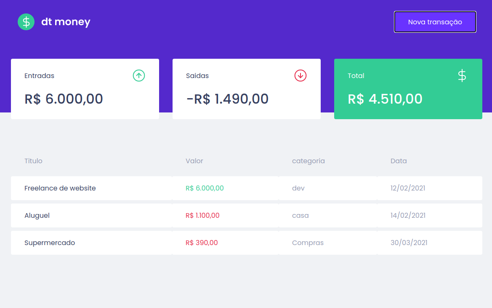

# Dtmoney




## 📝 Description

**Dtmoney** Project developed in the ignite journey of Rocketseat, where we created a web application for financial control of zero total using React.

---

## 💻 Used Technologies

This project has been developed using the following technologies:

- React
- Typescript
- Styled-conponents
- Axios
- Miragejs
- Polished
---

## 💻 Had Skill

skills developed in the project:

- Components
- Props
- State
- Immutability
- Hook's
    - useState
    - useEffet
    - useContext
---

## 📁 Download

```bash

# Clone the repository
$ https://github.com/KleytonLeite/react-dtmoney.git

# Enter into the directory
$ cd react-dtmoney

# Install dependencies
$ yarn

# Start the server
$ yarn start

```

---

Made with 💙 by Kleyton Leite 👋🏻 [Get in touch!](https://www.linkedin.com/in/kleyton-leite-a384a76b/)